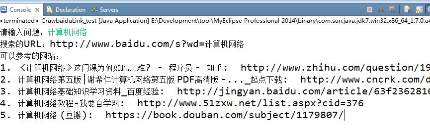
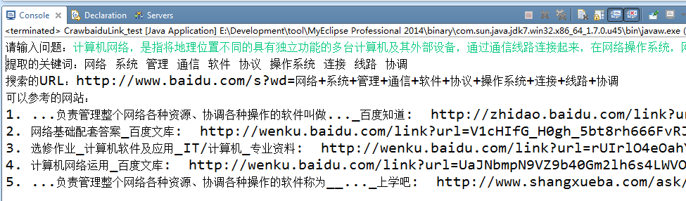

# 问题搜索

## 1.关键词提取

&#160; &#160; &#160; &#160;该部分依赖于复旦大学推出的自然语言处理开源项目[FudanNLP](https://github.com/xpqiu/fnlp/wiki/quicktutorial)（简称`FNLP`），`FNLP`包含中文分词、关键词抽取、命名实体识别、词性标注、时间词抽取、语法分析等功能

## 2.百度搜索结果的抓取	

&#160; &#160; &#160; &#160;百度的搜索条件不能多于38个汉字，因此如果问题比较短则可以直接搜索，否则根据提取的关键词进行搜索。
根据返回的html页面，寻找结果节点。在这部分，我采用的是[jsoup](https://jsoup.org/)，一款基于java的html解析器。

## 3.程序运行说明

&#160; &#160; &#160; &#160;`/src/org/nk/search/CrawbaiduLink_test.java`是入口程序。

#### 运行示例1：
&#160; &#160; &#160; &#160;输入文本：计算机网络。 

&#160; &#160; &#160; &#160;因为消息长度比较短，所以直接进行搜索，返回前5个查询结果的标题以及连接，结果如下图所示：

#### 运行示例2：
&#160; &#160; &#160; &#160;输入文本：计算机网络，是指将地理位置不同的具有独立功能的多台计算机及其外部设备，通过通信线路连接起来，在网络操作系统，网络管理软件及网络通信协议的管理和协调下，实现资源共享和信息传递的计算机系统。

&#160; &#160; &#160; &#160;因为消息长度比较长，所以先对其进行关键词提取，在消息中提取了10个关键词：【网络  系统   管理   通信   软件   协议   操作系统   连接   线路   协调】，接着根据关键词搜索，返回前5个查询结果的标题以及连接，结果如下图所示：

